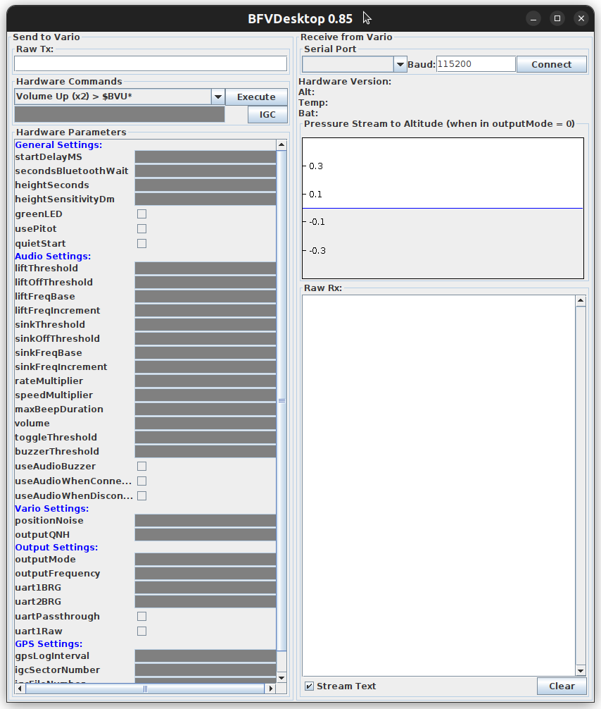

# How to use BFV Desktop

## Linux

### Requirements

* Java Run-Time
* Sudo permissions (required for using the serial connection)
* USB cable


### Installation

```sh
$ wget https://blueflyvario.com/files/BFVDesktop0.85.zip
$ unzip BFVDesktop0.85.zip
$ cd distr
```

### Usage

1. Connect the BlueFlyVario to computer via USB cable

2. Launch the BFVDesktop software as administrator (see below)

3. Select serial port `ttyUSB0` (with default 115,000 baud rate)

4. Click 'Connect'

When connecting, the software sends command `$BST*` to the vario, which responds with a never-ending stream of data.  The 'Raw Rx' panel will show something like:

```
$BST*
PRS 18738
PRS 18737
PRS 18738
$GNGGA,200729.000,3752.105089,N,12214.799547,W,1,4,1.90,176.023,M,-24.904,M,,*76
PRS 1873A
PRS 1873B
PRS 1873A
...
```


### Launching BFVDesktop

To launch BFVDesktop, call the following while `distr/` being the current directory:

```sh
$ sudo java -classpath "BFVDesktop.jar:jSerialComm.jar" bfv.desktop.BFVDesktop
```

Alternatively, you can use the equivalent:

```sh
$ sudo CLASSPATH="BFVDesktop.jar:jSerialComm.jar" java bfv.desktop.BFVDesktop
```

This opens the BFVDesktop window:




### Troubleshooting

If you run Java 1.8 and get:

```sh
Exception in thread "main" java.awt.AWTError: Assistive Technology not found: org.GNOME.Accessibility.AtkWrapper
	at java.awt.Toolkit.loadAssistiveTechnologies(Toolkit.java:807)
	at java.awt.Toolkit.getDefaultToolkit(Toolkit.java:886)
	at sun.swing.SwingUtilities2.getSystemMnemonicKeyMask(SwingUtilities2.java:2041)
	at javax.swing.plaf.basic.BasicLookAndFeel.initComponentDefaults(BasicLookAndFeel.java:1158)
	at javax.swing.plaf.metal.MetalLookAndFeel.initComponentDefaults(MetalLookAndFeel.java:431)
	at javax.swing.plaf.basic.BasicLookAndFeel.getDefaults(BasicLookAndFeel.java:148)
	at javax.swing.plaf.metal.MetalLookAndFeel.getDefaults(MetalLookAndFeel.java:1577)
	at javax.swing.UIManager.setLookAndFeel(UIManager.java:539)
	at javax.swing.UIManager.setLookAndFeel(UIManager.java:579)
	at javax.swing.UIManager.initializeDefaultLAF(UIManager.java:1349)
	at javax.swing.UIManager.initialize(UIManager.java:1459)
	at javax.swing.UIManager.maybeInitialize(UIManager.java:1426)
	at javax.swing.UIManager.getUI(UIManager.java:1006)
	at javax.swing.JPanel.updateUI(JPanel.java:126)
	at javax.swing.JPanel.<init>(JPanel.java:86)
	at javax.swing.JPanel.<init>(JPanel.java:109)
	at javax.swing.JPanel.<init>(JPanel.java:117)
	at bfv.desktop.BFVDesktop.<init>(Unknown Source)
	at bfv.desktop.BFVDesktop.main(Unknown Source)
```

then comment out the `assistive_technologies` setting in `/etc/java-8-openjdk/accessibility.properties` [1]:

```sh
$ cat /etc/java-8-openjdk/accessibility.properties
#
# The following line specifies the assistive technology classes
# that should be loaded into the Java VM when the AWT is initailized.
# Specify multiple classes by separating them with commas.
# Note: the line below cannot end the file (there must be at
# a minimum a blank line following it).
#
assistive_technologies=org.GNOME.Accessibility.AtkWrapper
```

You need sudo rights to do this.  You can comment this out using:

```sh
$ sudo sed -i -E "s/^(assistive_technologies=)/## [Disabled by $USER on $(date --rfc-3339=seconds)] # \\1/" /etc/java-8-openjdk/accessibility.properties
```

I've verified that this is sufficient on my Ubuntu 22.04 machine with Java 1.8.0;

```sh
$ java -version
openjdk version "1.8.0_362"
OpenJDK Runtime Environment (build 1.8.0_362-8u362-ga-0ubuntu1~22.04-b09)
OpenJDK 64-Bit Server VM (build 25.362-b09, mixed mode)
```


## How to

### Identify firmware version

With vario physically connected via USB cable but not connected in BFVDesktop:

1. Turn off vario
2. Connect to vario (`ttyUSB0`)
3. Turn vario back on
4. Disconnect briefly afterward

The raw data stream should now show something like:

```
$BST*
\0
Bluefly Power On
BFV 22.2 566
BlueFlyVario_BLUETOOTH_GPS_IGC_22.2.566
BST BFK BFL BFP BAC BAD BTH BFQ BFI BSQ BSI BFS BOL BOS BRM BVL BOM BOF BQH BRB BPT BUR BLD BR2 BHV BHT BBZ BZT BSM BUP BTT BDM BQS BGL BSN BFN BMP BPN
...
```

From this output, we can tell that the firmware of v22.2 release 566.
From <https://www.blueflyvario.com/files/v22/>, we can see that it was
released on 2022-10-08.


## References

* [1] <https://stackoverflow.com/questions/15260989>
